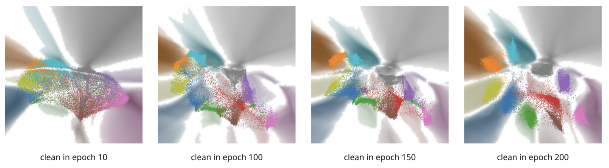

# Training Dynamic Visualization


## Overview

Training Dynamic Visualization, a technique designed to visualize high-dimensional representations during the deep learning training process. In other words, our method is designed to transform the model training dynamics into an animation of canvas with colorful dots and territories.





## Installation

#### Setup Environment

1. create conda environment
```
$ conda create -n visualizer python=3.7
$ (visualizer) ~/time-travelling-visualizer$ conda activate visualizer
```

2. install pyTorch and CUDA
For setting up PyTorch on that conda environment, use the guidelines provided at [PyTorch's official local installation page](https://pytorch.org/get-started/locally/). This guide will help you select the appropriate configuration based on your operating system, package manager, Python version, and CUDA version.

3. install requirements

For Linux developers, you can use the following command to install the required packages.
```
$ (visualizer) ~/time-travelling-visualizer$ pip install -r requirements.txt
```
For windows developers, you can use the following command instead.
```
$ (visualizer) ~/time-travelling-visualizer$ pip install -r win-requirements.txt
```

Note that, if you are using VPN or other proxy, please specify `--proxy` parameter to install the packages.

4. vector database environment configuration
If you wish to explore the vector database extension on our visualization tool, please follow the steps below to install the necessary packages.

Please note that the **versions** of Docker and Docker Compose are important! You can refer to the official documentation, [Milvus's Prerequisties](https://milvus.io/docs/prerequisite-docker.md), or simply follow the commands provided below.

For linux developers, you can use the following command to install Docker and Docker Compose.
```
$ (visualizer) ~/time-travelling-visualizer$ pip install docker==6.1.3
$ (visualizer) ~/time-travelling-visualizer$ pip install docker-compose==1.29.2
```

For windows developers, Windows with WSL 2 enabled and Docker Desktop are needed.

For installing Linux on Windows with WSL, use the guidelines provided at [Microsofts's official WSL installation page](https://learn.microsoft.com/en-us/windows/wsl/install) 

When your WSL is ready, you should move both your **source code** and **training dynamics** into WSL file system.

For setting up WSL 2 with Docker Desktop, see [WSL](https://docs.docker.com/desktop/wsl/).

And if you want to open your WSL distribution in VS Code, refer to the documentation at [Microsofts's official WSL tutorial for vscode](https://learn.microsoft.com/en-us/windows/wsl/tutorials/wsl-vscode) 

After completing the above steps, you should install Docker Compose by:
```
$ (visualizer) ~/time-travelling-visualizer$ pip install docker-compose==1.29.2
```


#### Pull Our Code

We strongly recommend that you store source code and training dynamics in the **Linux file system** instead of the Windows file system to get a complete user experience.

```
git clone https://github.com/code-philia/time-travelling-visualizer.git
```

The project structure looks as follow:

- [ ] TO-DO: file structure for **new version** and **clean** project.

- **`Tool`** folder contains the main logic of the project, including:
  - training the visualization models of various visualization methods
  - interactive visualization tool's back-end and front-end
- **`training_dynamic`** folder is for storing the dataset which we will explain in detail later.


## Quick Start

We have prepared an example to quickly demonstrate the capabilities of the tool, it is available on [Hugging Face](https://huggingface.co/datasets/code-philia/mtpnet) for you to download.

1. Download training dynamics example from Hugging Face

```
~/time-travelling-visualizer$ cd training_dynamic
~/time-travelling-visualizer/training_dynamic$ git lfs clone https://huggingface.co/datasets/code-philia/mtpnet.git
~/time-travelling-visualizer/training_dynamic$ unzip mtpnet/case_study_mnist_backdoor.zip
```

2. Unzip the dataset file

For linux user, you can unzip the example dataset into training_dynamic directory using the command

```
~/time-travelling-visualizer/training_dynamic$ unzip mtpnet/case_study_mnist_backdoor.zip
```

For windows user, you can unzip the example dataset into training_dynamic directory using the command

```
~/time-travelling-visualizer/training_dynamic$ Expand-Archive mtpnet/case_study_mnist_backdoor.zip -DestinationPath .
```

3. Run interactive visualizer tool

```
~/time-travelling-visualizer/Tool/server$ conda activate visualizer
~/time-travelling-visualizer$ cd /Tool/server
```

For linux and WSL users, you can use this command to start the tool with vector database (It will take a few minutes to start the docker container in the first time)

```
~/time-travelling-visualizer/Tool/server$ (visualizer) ./start_server.sh 
```

Windows users can use the following command instead to run the tool

```
~/time-travelling-visualizer/Tool/server$ (visualizer) python server.py
```

you will see: 

- [ ] TO-DO: screen shot for new version tool interface and console output.


## GUIDE

To visualize your own training process, please refer to SPEC.md


---

# Citation

```
@inproceedings{yang2023deepdebugger,
  title={DeepDebugger: An Interactive Time-Travelling Debugging Approach for Deep Classifiers},
  author={Yang, Xianglin and Lin, Yun and Zhang, Yifan and Huang, Linpeng and Dong, Jin Song and Mei, Hong},
  booktitle={Proceedings of the 31st ACM Joint European Software Engineering Conference and Symposium on the Foundations of Software Engineering},
  pages={973--985},
  year={2023}
}


@inproceedings{yang2022temporality,
  title={Temporality Spatialization: A Scalable and Faithful Time-Travelling Visualization for Deep Classifier Training},
  author={Yang, Xianglin and Lin, Yun and Liu, Ruofan and Dong, Jin Song},
  booktitle = {Proceedings of the Thirty-First International Joint Conference on Artificial Intelligence, {IJCAI-22}},
  year={2022}
}

@inproceedings{yang2022deepvisualinsight,
  title={DeepVisualInsight: Time-Travelling Visualization for Spatio-Temporal Causality of Deep Classification Training},
  author={Yang, Xianglin and Lin, Yun and Liu, Ruofan and He, Zhenfeng and Wang, Chao and Dong, Jin Song and Mei, Hong},
  booktitle = {The Thirty-Sixth AAAI Conference on Artificial Intelligence (AAAI)},
  year={2022}
}
```

## Acknowledgement

We appreciate all our collaborators for their contributions in this project:

Xianglin Yang, Ruofan Liu, Guorui Qin, ... (the list is expanding)
