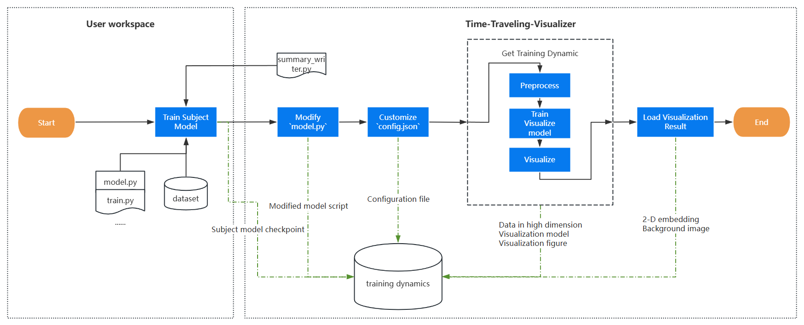
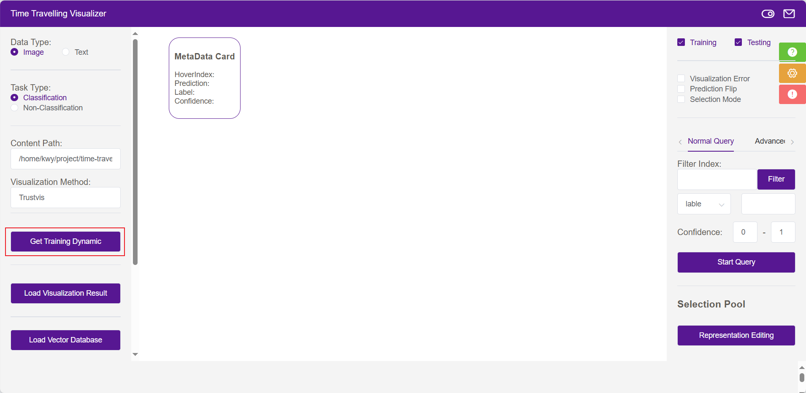

# Visualize Your Own Training Process

## Getting started

In this section, we will explain how to obtain and visualize your own training dynamics. The whole process can be summarized in this graph:




#### Step 1: Train subject model

In this part you need to train your subject model. During the training process, you need to use `SummaryWriter` (defined in `Tool/server/summary_writer.py`) to record sprites, dataset and checkout(each or every k epoch). What you need to do is:

- After loading the `dataset` and constructing `dataloader`, initialize the `writer` and record dataset and sprites:

  ```python
  # Added code to write into training dynamic
  from summary_writer import SummaryWriter
  save_dir = '/path/to/training_dynamic'
  summary_writer = SummaryWriter(save_dir, batch_size, num_worker)
  summary_writer.write_meta_data(train_loader, test_loader)
  ```

- And when you want to save the checkpoint (each or every k epoch), also use `summary_writer`:
  
  ```python
  # After training model
  writer.write_checkpoint(model.state_dict(),curr_epoch, prev_epoch)
  ```
  
  where `model` is your subject model, `curr_epoch` is the current epoch index (starting from 1),`prev_epoch` is previous epoch in which you saved checkpoint.
  
  
  
  💡If you want to save checkpoint every `k` epoch, then `prev_epoch = curr_epoch - k`


After the training process with summary written, the `training_dynamic` folder may look like:

```markdown
training_dynamic
|
└─── Sprites
│    │ 0.png
│    │ 1.png
│    │ ...
│
└───Model
│   └───Epoch_1
│       │   subject_model.pth
│   └───Epoch_2
|       |   subject_model.pth
│   └───Epoch_3
|       |   ...
│   
└───Training_data
|   │   training_dataset_data.pth (concatenate training data)
|   │   training_dataset_label.pth (concatenate training label)
│   
└───Testing_data
│   │   testing_dataset_data.pth (concatenate testing data)
│   │   testing_dataset_label.pth (concatenate testing label)
```


#### Step 2: Modify `model.py`

For a classification task, your classification model can be divided into two parts: feature funtion and prediction funtion. The prediction funtion will be the last layer, and the feature function will include the first several layers of the model, you can refer to the following example to construct your own `feature` and `predict` function.


If the forward function of your model is like:

```python
def forward(self, x):
    x = self.conv1(x)
    x = self.bn1(x)
    x = self.relu(x)
    x = self.maxpool(x)

    x = self.layer1(x)
    x = self.layer2(x)
    x = self.layer3(x)
    x = self.layer4(x)

    x = self.avgpool(x)
    x = x.reshape(x.size(0), -1)
    x = self.fc(x)

    return x
```

then you can devide it into feature part and prediction part:

```python
def feature(self, x):
    x = self.conv1(x)
    x = self.bn1(x)
    x = self.relu(x)
    x = self.maxpool(x)

    x = self.layer1(x)
    x = self.layer2(x)
    x = self.layer3(x)
    x = self.layer4(x)

    x = self.avgpool(x)
    x = x.reshape(x.size(0), -1)
    return x

def prediction(self, x):
    x = self.fc(x)
    return x
```

Once you have modified the `model.py` file, copy it to the `training_dynamic/Model` directory.


#### Step 3: Customize your own `config.json`

You can configure multiple visualize methods at the same time in the `config.json` file. For example, if you want to create configuration for `Trustvis` method, add an item in `config.json` like:

```json
{
    "Trustvis":{
        ......
    }
}
```

Here is an example for the configuration:

```json
{    
    "Trustvis": {
        "SETTING": "normal", // Defines the data setting mode
        "CLASSES": ["plane", "car", "bird", "cat", "deer", "dog", "frog", "horse", "ship", "truck"], // List of classes in the dataset
        "GPU": "0", // GPU ID for training
        "EPOCH_START": 1, // Starting epoch for training
        "EPOCH_END": 20, // Ending epoch for training
        "EPOCH_PERIOD": 1, // Interval between each epoch to log or save data
        "EPOCH_NAME":"Epoch", // Label for the epoch in logs or visualizations
        
        // subject model
        "TRAINING": {
            "NET": "resnet18",   // Model architecture for training
            "train_num": 50000, // Number of training samples
            "test_num": 10000, // Number of test samples
        },
        
        // visulization model
        "VISUALIZATION": {
            "BOUNDARY": {
                "B_N_EPOCHS": 1, // Number of epochs to fit boundary samples per iteration
                "L_BOUND": 0.4 // Lower bound for selecting boundary samples
            },
            "BATCH_SIZE":1000, // Batch size for visualization process
            "LAMBDA1": 1.0, // Weight of reconstruction loss in the visualization model
            "LAMBDA2": 0.3, // Weight of temporal loss in the visualization model
            "ENCODER_DIMS": [512,256,256,256,256,2],  // Encoder architecture for the visualization model
            "DECODER_DIMS": [2,256,256,256,256,512],  // Decoder architecture for the visualization model
            "N_NEIGHBORS": 15, // Number of local neighbors for constructing the neighborhood graph
            "MAX_EPOCH": 20,  // Maximum number of epochs for training the visualization model
            "S_N_EPOCHS": 10, // Number of epochs for edge sampling in the complex construction process
            "PATIENT": 3, // Patience for early stopping, based on loss not improving
            "RESOLUTION": 300, // Resolution of the visualization canvas
            "VIS_MODEL_NAME": "vismodel",  // Visualization model name to save
        }
    }
}
```

We can divide the configuration into three parts:

- **general configuration**: some global configuration and dataset related settings;
- **subject model configuration**: defines the subject model used for training and its associated configuration, including training parameters and optimizer parameters;
- **visualization model configuration**: defines the visualization model used for data visualization and its parameter settings.

Once you have finished the `config.json` file, put it to the `training_dynamic` directory.


💡You can mainly focus on the general configuration and subject model configuration. 


#### Step 4: Obtain the training dynamics

After preparing the materials and finishing configuration, it's time to train the visualization model and get the training dynamics.

1. Start up the server:

```
~/time-travelling-visualizer/Tool/server$ (visualizer) python server.py
```

fill in the content path and visualization method on the left which should align with the configuration and folder name in training_dynamic. 

💡e.g. `path/to/training_dynamic` for the content path and `Trustvis`  for visualization method.


2. Click the `Get Training Dynamics` button, and this will trigger the following process:
   - **[pre-process]** : loading subject model and obtaining high-dimensional representations through the feature layer of your subject model. (saved in `train_data.npy` and `test_data.npy`)
   - **[train vismodel]** : training a visualization model using the high-dimensional representations. (saved in `VIS_MODEL_NAME.pth`)
   - **[visualize]** : using the visualization model to map a data sample to 2D-space and save the figure as`img/VIS_MODEL_NAME_EPOCH.png`.




After all the process finished, your training dynamics folder should look like:

```markdown
training_dynamic/data_example_1
|
└───img
|   | Trustvis_1.png (new)
|   | ...
|
└───sprites
│   │ 0.png
│   │ 1.png
│   │ ...
│
└───Model
│   │   model.py
│   │
│   └───Epoch_1
│       │   subject_model.pth
|       |   train_data.npy     [after preprocess] (new)
|       |   test_data.npy      [after preprocess] (new)
|       |   vismodel.pth       [after trained]    (new)
│   └───Epoch_2
|       |   ...
│   
└───Training_data
|   │   training_dataset_data.pth (concatenate training data)
|   │   training_dataset_label.pth (concatenate training label)
│   
└───Testing_data
│   │   testing_dataset_data.pth (concatenate testing data)
│   │   testing_dataset_label.pth (concatenate testing label)
|
└───config.json
|
└───time.json, ......(other results during the training and evaluation process) (new)
```


#### Step 5: Visualize the training dynamics

Click `Load Visualization Result` button, and see how each sample is predicted in each epoch.


- [ ] TODO: 展示vscode插件界面


## Functionality

- [ ] TODO: 展示现在有哪些功能（结合新界面）
